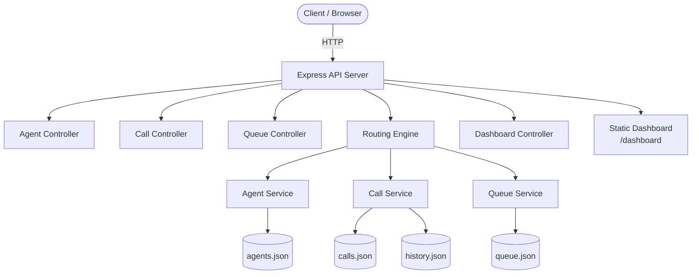
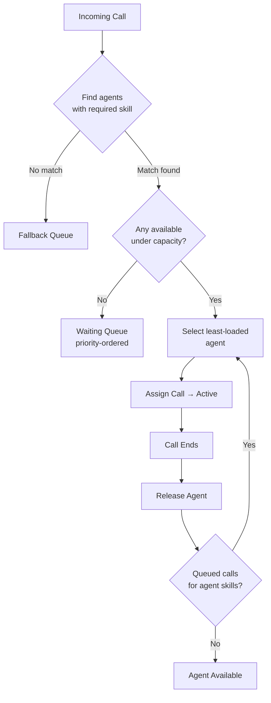
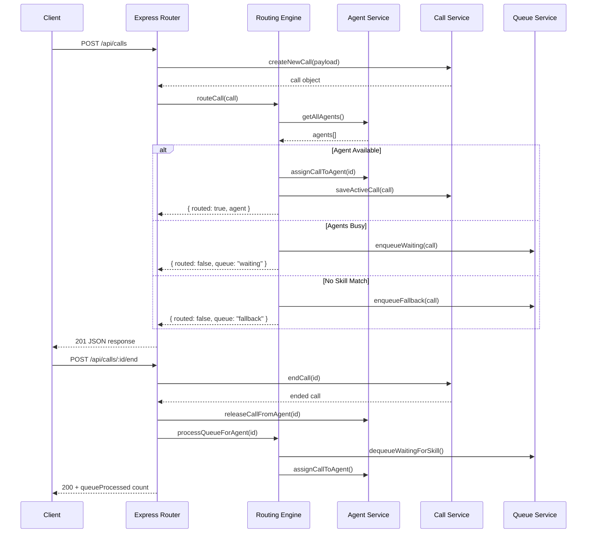
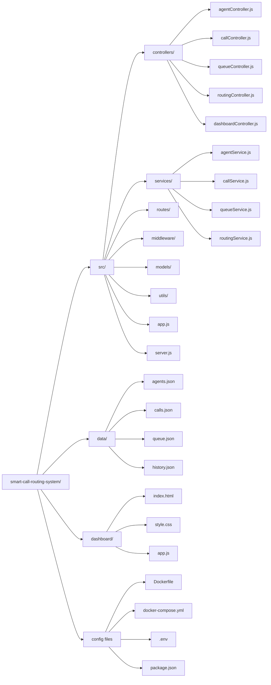

<div align="center">

# ⬡ Smart Call Routing System

**Production-grade call center routing engine — skill-based routing, load balancing, priority queues, and a live dashboard.**


</div>

---

## Overview

Smart Call Routing System simulates how enterprise contact centers intelligently route inbound calls to agents. It demonstrates core backend engineering patterns: service-layer architecture, REST API design, priority queue management, and event-driven state transitions.

Built as a portfolio project to showcase system design thinking, clean code structure, and deployment-ready practices.

---

## Features

- **Skill-Based Routing** — matches calls to agents by required skill
- **Load Balancing** — assigns to least-loaded available agent
- **Capacity Control** — respects each agent's configurable max capacity
- **Priority Queue** — urgent > high > medium > low call ordering
- **Waiting Queue** — holds calls when all matching agents are busy
- **Fallback Queue** — captures calls with no matching skill agent
- **Auto Queue Processing** — reassigns queued calls when agents free up
- **Live Dashboard** — Vercel-style UI with real-time refresh
- **Structured Logging** — JSON logs with level filtering
- **Docker Ready** — multi-stage Dockerfile + compose

---

## Architecture



---

## Routing Flow



---

## API Flow



---

## Folder Structure



---

## Installation

### Prerequisites

- Node.js 18+
- npm

### Local Setup

```bash
# Clone the repository
git clone https://github.com/yourusername/smart-call-routing-system.git
cd smart-call-routing-system

# Install dependencies
npm install

# Start the server
npm start
```

Open **http://localhost:3000** for the dashboard.

---

## Docker Setup

```bash
# Build and run with Docker Compose
docker-compose up --build

# Or build manually
docker build -t smart-call-routing .
docker run -p 3000:3000 smart-call-routing
```

---

## API Documentation

### Base URL

```
http://localhost:3000/api
```

### Agents

| Method | Endpoint | Description |
|--------|----------|-------------|
| `GET` | `/agents` | List all agents (filter: `?status=available&skill=billing`) |
| `GET` | `/agents/status` | Agents grouped by status |
| `GET` | `/agents/:id` | Get single agent |
| `POST` | `/agents` | Create agent |
| `PUT` | `/agents/:id` | Update agent |
| `DELETE` | `/agents/:id` | Delete agent |

**Create Agent — Request Body:**
```json
{
  "name": "Jane Smith",
  "skills": ["billing", "general"],
  "maxCapacity": 3
}
```

Valid skills: `billing`, `technical`, `sales`, `general`, `networking`

---

### Calls

| Method | Endpoint | Description |
|--------|----------|-------------|
| `GET` | `/calls` | Active calls (filter: `?status=active&agentId=x`) |
| `GET` | `/calls/history` | Ended calls |
| `POST` | `/calls` | Create and route a call |
| `POST` | `/calls/:id/end` | End a call, trigger queue processing |

**Create Call — Request Body:**
```json
{
  "customerName": "John Doe",
  "requiredSkill": "technical",
  "priority": "high"
}
```

Valid priorities: `low`, `medium`, `high`, `urgent`

---

### Queue

| Method | Endpoint | Description |
|--------|----------|-------------|
| `GET` | `/queue` | Full queue snapshot with stats |

---

### Routing

| Method | Endpoint | Description |
|--------|----------|-------------|
| `POST` | `/routing/process` | Force-process entire waiting queue |

---

### Dashboard & Health

| Method | Endpoint | Description |
|--------|----------|-------------|
| `GET` | `/dashboard/stats` | Aggregated system stats |
| `GET` | `/health` | Service health check |

---

## Environment Variables

| Variable | Default | Description |
|----------|---------|-------------|
| `PORT` | `3000` | HTTP server port |
| `NODE_ENV` | `development` | Environment mode |
| `DATA_DIR` | `./data` | JSON data directory |
| `LOG_LEVEL` | `info` | Log level: `debug`/`info`/`warn`/`error` |

---

## Engineering Patterns

| Pattern | Implementation |
|---------|---------------|
| Service Layer | Controllers delegate logic to services |
| Centralized Error Handling | `errorHandler.js` middleware |
| Standardized Responses | `utils/response.js` helpers |
| Request Validation | Model-level validators |
| Structured Logging | JSON logger with levels |
| Atomic File Writes | Temp file + rename strategy |
| Graceful Shutdown | SIGTERM/SIGINT handlers |

---

## Future Enhancements

- [ ] WebSocket live push (no polling)
- [ ] PostgreSQL / Redis persistence
- [ ] JWT authentication
- [ ] Call recording simulation
- [ ] Agent performance metrics & SLA tracking
- [ ] Multi-tenant support
- [ ] Horizontal scaling with Redis queue

---

## Author

Built as a portfolio project demonstrating backend systems design, REST API architecture, and production engineering practices.

---

<div align="center">
  <sub>MIT License</sub>
</div>
